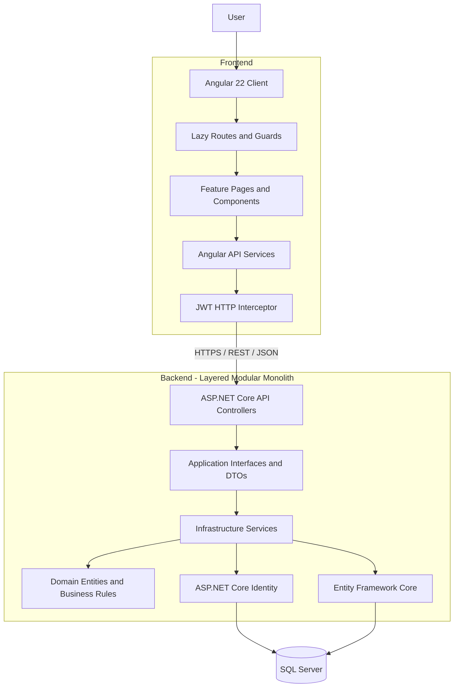
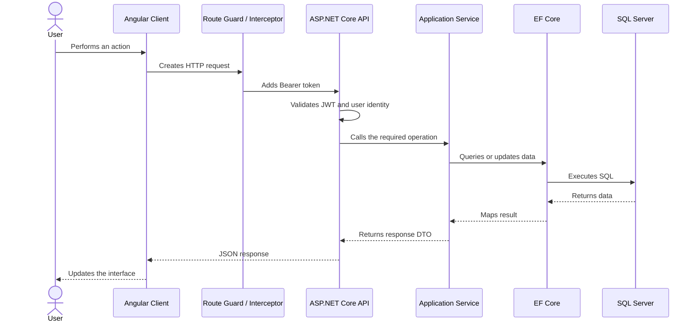
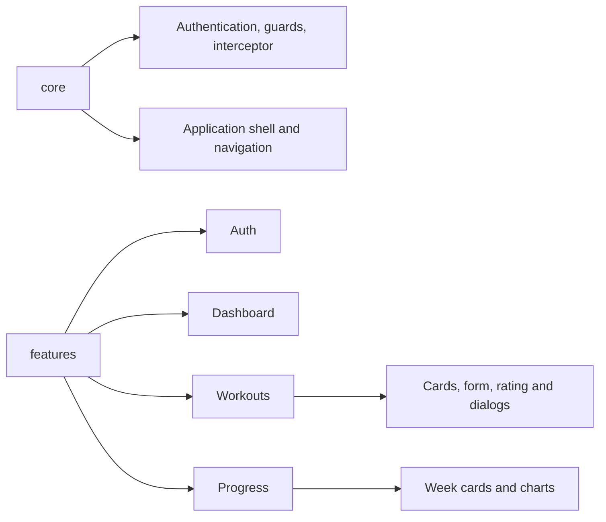
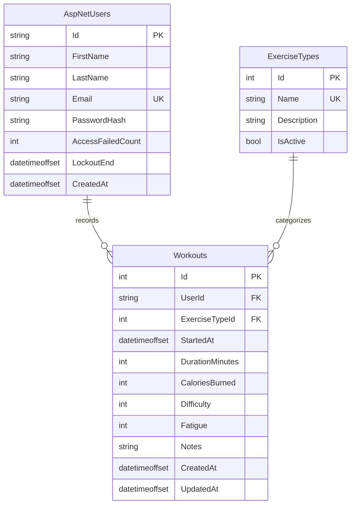

# Fitness Tracker

Fitness Tracker is a full-stack web application for recording workouts and monitoring personal progress over time. Users can create an account, securely sign in, manage their workout history, and review weekly statistics for a selected month.

The project was built as a technical assignment with an emphasis on clear separation of concerns, maintainable code, responsive design, secure authentication, and a user-friendly experience.

## Table of Contents

- [Features](#features)
- [Technology Stack](#technology-stack)
- [System Architecture](#system-architecture)
- [Backend Architecture](#backend-architecture)
- [Frontend Architecture](#frontend-architecture)
- [Database Design](#database-design)
- [Authentication and Security](#authentication-and-security)
- [Validation Rules](#validation-rules)
- [API Endpoints](#api-endpoints)
- [Prerequisites](#prerequisites)
- [Configuration](#configuration)
- [Database Setup](#database-setup)
- [Running the Application](#running-the-application)
- [Testing the API with Swagger](#testing-the-api-with-swagger)
- [Build and Tests](#build-and-tests)
- [Project Structure](#project-structure)
- [Troubleshooting](#troubleshooting)
- [Possible Future Improvements](#possible-future-improvements)
- [Author](#author)

## Features

### Authentication

- User registration with first name, last name, email, and password
- Secure login with JWT access tokens
- Password hashing through ASP.NET Core Identity
- Unique email addresses
- Temporary account lockout after repeated failed login attempts
- Protected Angular routes
- Automatic JWT attachment through an HTTP interceptor
- Automatic logout when the token expires or the API returns `401 Unauthorized`

### Workout Management

- Create, view, update, and delete personal workouts
- Supported exercise types: Cardio, Strength, and Flexibility
- Record date and time, duration, burned calories, difficulty, fatigue, and optional notes
- Interactive 1–10 difficulty and fatigue selectors
- Localized date and time picker
- Prevention of future workout dates
- Filtering by exercise type
- Client-side pagination with nine workouts per page
- Confirmation before deletion
- Responsive workout cards with category-specific images
- Loading, empty, success, and error states

### Dashboard

- Personalized greeting
- Current-week workout count
- Current-week total duration
- Average workout difficulty
- Average post-workout fatigue
- Quick access to the workout form
- Three most recent workouts

### Progress Analytics

- Month and year selection without future periods
- Monthly data divided into calendar weeks
- Workout count and total duration for every week
- Average difficulty and fatigue for every week
- Empty weeks displayed without invalid average values
- Interactive monthly difficulty and fatigue chart
- Detailed view of a selected week
- Per-workout difficulty and fatigue chart for the selected week
- Tooltips with exact dates and values

## Technology Stack

### Frontend

- Angular 22
- TypeScript 6
- Standalone Angular components
- Angular Signals
- Angular Reactive Forms
- Angular Router with lazy-loaded routes
- RxJS
- Tailwind CSS 4
- Native SVG charts
- Vitest

### Backend

- .NET 9
- ASP.NET Core Web API
- Entity Framework Core 9
- ASP.NET Core Identity
- JWT Bearer authentication
- Swagger / OpenAPI
- Dependency Injection

### Database

- Microsoft SQL Server / SQL Server Express
- Entity Framework Core migrations
- Fluent entity configuration
- Database constraints and indexes

## System Architecture

The application is implemented as a layered modular monolith. A single ASP.NET Core API hosts the backend, while responsibilities are separated into API, Application, Domain, and Infrastructure projects.



### Request Flow



## Backend Architecture

### `FitnessTracker.Domain`

Contains the core domain entities and their invariants:

- `Workout`
- `ExerciseType`

The `Workout` entity protects its state through private setters and validates data during creation and update. Domain rules therefore do not depend only on frontend validation.

### `FitnessTracker.Application`

Defines the contracts used by the application:

- Authentication, workout, exercise type, and progress service interfaces
- Request and response DTOs
- Operation result models

This layer depends on the Domain project but does not depend on Entity Framework Core or ASP.NET Core controllers.

### `FitnessTracker.Infrastructure`

Contains technical implementations:

- Entity Framework Core `ApplicationDbContext`
- SQL Server configuration
- ASP.NET Core Identity user store
- JWT token generation
- Authentication service
- Workout CRUD service
- Exercise type service
- Monthly progress aggregation
- Entity configurations and migrations

### `FitnessTracker.Api`

Acts as the HTTP entry point:

- REST controllers
- JWT validation
- CORS policy
- Swagger/OpenAPI configuration
- Dependency registration
- HTTP status code and validation response handling

### Architectural Patterns

The solution uses several patterns without introducing unnecessary abstractions:

- Dependency Injection
- Service Layer
- DTO pattern
- Options pattern for JWT configuration
- Repository and Unit of Work behavior through EF Core `DbContext`
- Angular HTTP Interceptor
- Angular route guards
- Feature-based frontend organization

A custom generic repository was intentionally not added because EF Core already provides the required repository and unit-of-work behavior for this project's scope.

## Frontend Architecture

The Angular client uses standalone components and feature-based organization. Pages coordinate data, while reusable UI elements are extracted into focused components.



The main frontend routes are:

| Route | Access | Purpose |
|---|---|---|
| `/login` | Guest | Sign in |
| `/register` | Guest | Create an account |
| `/dashboard` | Authenticated | Current-week summary and recent workouts |
| `/workouts` | Authenticated | Workout management, filtering, and pagination |
| `/progress` | Authenticated | Monthly and weekly progress analytics |

The interface is responsive and localized in Serbian Latin (`sr-Latn`). User-facing API errors are translated into clear messages rather than exposing technical backend details.

## Database Design

The application uses one SQL Server database named `FitnessTrackerDb`.



ASP.NET Core Identity also creates its supporting tables, including roles, claims, logins, tokens, and user-role relationships.

### Relationships and Delete Behavior

- One user can record many workouts.
- Every workout belongs to exactly one user.
- One exercise type can categorize many workouts.
- Deleting a user cascades to that user's workouts.
- Deleting an exercise type referenced by workouts is restricted.

### Constraints and Indexes

- `DurationMinutes > 0`
- `CaloriesBurned >= 0`
- `Difficulty` between 1 and 10
- `Fatigue` between 1 and 10
- Notes limited to 1000 characters
- Unique exercise type name
- Composite index on `(UserId, StartedAt)` for user-specific chronological queries

The initial migration seeds the following exercise types:

1. Cardio
2. Strength
3. Flexibility

No user account is seeded. Create an account through the registration screen or Swagger.

## Authentication and Security

The application uses ASP.NET Core Identity for user management and password hashing. Plain-text passwords are never stored in the database.

After registration or login, the API issues a signed JWT access token containing the user's identifier, email, first name, and last name. Angular stores the token locally and sends it in the `Authorization: Bearer <token>` header for protected requests.

Security-related behavior includes:

- Password hashing through ASP.NET Core Identity
- JWT signature, issuer, audience, and lifetime validation
- JWT signing key stored outside source control through .NET User Secrets
- Unique email requirement
- Five-minute lockout after five failed login attempts
- User ID read from the authenticated JWT instead of request payloads
- Every workout query scoped to the authenticated user
- CORS restricted to the configured frontend origin
- Short JWT clock-skew tolerance

## Validation Rules

| Field | Rules |
|---|---|
| First name | Required, maximum 50 characters |
| Last name | Required, maximum 50 characters |
| Email | Required, valid format, unique |
| Password | Minimum 8 characters, uppercase letter, lowercase letter, and number |
| Exercise type | Required and must be active |
| Workout date | Required and cannot be in the future |
| Duration | At least 1 minute |
| Calories | Zero or greater |
| Difficulty | Required value from 1 to 10 |
| Fatigue | Required value from 1 to 10 |
| Notes | Optional, maximum 1000 characters |

Validation is applied at multiple levels: Angular forms, domain entities, application services, EF Core configuration, and SQL check constraints.

## API Endpoints

All endpoints except registration and login require a valid Bearer token.

### Authentication

| Method | Endpoint | Description | Success |
|---|---|---|---|
| `POST` | `/api/auth/register` | Register a user and return a JWT | `201 Created` |
| `POST` | `/api/auth/login` | Authenticate a user and return a JWT | `200 OK` |

### Exercise Types

| Method | Endpoint | Description | Success |
|---|---|---|---|
| `GET` | `/api/exercise-types` | Get active exercise types | `200 OK` |

### Workouts

| Method | Endpoint | Description | Success |
|---|---|---|---|
| `GET` | `/api/workouts` | Get the authenticated user's workouts | `200 OK` |
| `GET` | `/api/workouts/{id}` | Get one owned workout | `200 OK` |
| `POST` | `/api/workouts` | Create a workout | `201 Created` |
| `PUT` | `/api/workouts/{id}` | Update an owned workout | `200 OK` |
| `DELETE` | `/api/workouts/{id}` | Delete an owned workout | `204 No Content` |

### Progress

| Method | Endpoint | Description | Success |
|---|---|---|---|
| `GET` | `/api/progress/monthly?year={year}&month={month}` | Get weekly statistics for a selected month | `200 OK` |

The progress response includes every calendar-week segment inside the selected month, including empty weeks. Weeks start on Monday and end on Sunday, except partial weeks at the beginning or end of a month.

## Prerequisites

Install the following software before running the project:

- Git
- Visual Studio 2022 with the **ASP.NET and web development** workload
- .NET 9 SDK
- Node.js 22 LTS or another Angular 22-compatible version
- npm
- SQL Server Express or SQL Server Developer
- SQL Server Management Studio (recommended)
- Visual Studio Code (recommended for the Angular client)

Verify the installations:

```powershell
git --version
dotnet --version
node --version
npm --version
```

## Configuration

### Clone the Repository

```powershell
git clone https://github.com/coddag13/fitness-tracker.git
Set-Location fitness-tracker
```

### SQL Server Connection

The default development connection string in `FitnessTracker.Api/appsettings.json` uses the local `SQLEXPRESS` instance:

```json
{
  "ConnectionStrings": {
    "DefaultConnection": "Server=.\\SQLEXPRESS;Database=FitnessTrackerDb;Trusted_Connection=True;TrustServerCertificate=True;MultipleActiveResultSets=true"
  }
}
```

If your SQL Server instance has a different name, update only this value. Examples include `(localdb)\\MSSQLLocalDB` or a custom SQL Server instance.

### JWT Signing Key

The JWT signing key is intentionally not committed. Configure it with .NET User Secrets from the repository root:

```powershell
dotnet user-secrets set "Jwt:Key" "replace-this-with-a-private-key-of-at-least-32-bytes" --project FitnessTracker.Api
```

The configured key must contain at least 32 bytes. Do not add a real production key to `appsettings.json` or commit it to Git.

Current non-secret JWT settings are:

```json
{
  "Jwt": {
    "Issuer": "FitnessTracker.Api",
    "Audience": "FitnessTracker.Client",
    "ExpirationMinutes": 60
  }
}
```

### Frontend API URL

The Angular client currently uses:

```text
https://localhost:7088/api
```

It is configured in `frontend/src/app/app.config.ts`. If the backend HTTPS port changes, update the `API_BASE_URL` provider there and update the CORS origin in `FitnessTracker.Api/appsettings.json` when necessary.

### Local HTTPS Certificate

Trust the ASP.NET Core development certificate if required:

```powershell
dotnet dev-certs https --trust
```

## Database Setup

The repository contains an EF Core migration that creates the schema, Identity tables, constraints, indexes, and initial exercise types.

### Visual Studio Package Manager Console

Open `FitnessTracker.sln`, then run:

```powershell
Update-Database -Project FitnessTracker.Infrastructure -StartupProject FitnessTracker.Api
```

### .NET CLI

If `dotnet-ef` is not installed:

```powershell
dotnet tool install --global dotnet-ef --version 9.0.14
```

Apply the migration from the repository root:

```powershell
dotnet ef database update --project FitnessTracker.Infrastructure --startup-project FitnessTracker.Api
```

The command creates `FitnessTrackerDb` automatically when the configured Windows account has permission to create databases.

## Running the Application

### Recommended Development Workflow

Run the backend in Visual Studio and the frontend in Visual Studio Code.

#### 1. Start the Backend

1. Open `FitnessTracker.sln` in Visual Studio 2022.
2. Set `FitnessTracker.Api` as the startup project.
3. Select the `https` launch profile.
4. Start without debugging (`Ctrl+F5`) or with debugging (`F5`).

Swagger opens automatically at:

```text
https://localhost:7088/swagger
```

Alternatively, start the API from PowerShell:

```powershell
dotnet restore
dotnet run --project FitnessTracker.Api --launch-profile https
```

#### 2. Start the Frontend

Open another terminal:

```powershell
Set-Location frontend
npm install
npm start
```

Open:

```text
http://localhost:4200
```

### Useful URLs

| Service | URL |
|---|---|
| Angular frontend | `http://localhost:4200` |
| Swagger UI | `https://localhost:7088/swagger` |
| API base URL | `https://localhost:7088/api` |
| HTTP API profile | `http://localhost:5165` |

## Testing the API with Swagger

1. Open Swagger.
2. Execute `POST /api/auth/register` or `POST /api/auth/login`.
3. Copy the returned `accessToken`.
4. Select **Authorize** in Swagger.
5. Paste the token into the Bearer authentication field.
6. Test exercise type, workout, and progress endpoints.

Example registration request:

```json
{
  "firstName": "Test",
  "lastName": "User",
  "email": "test.user@example.com",
  "password": "Password1"
}
```

Example workout request:

```json
{
  "exerciseTypeId": 1,
  "startedAt": "2026-09-03T08:30:00+02:00",
  "durationMinutes": 45,
  "caloriesBurned": 320,
  "difficulty": 7,
  "fatigue": 6,
  "notes": "Morning cardio session"
}
```

## Build and Tests

Build the backend:

```powershell
dotnet build FitnessTracker.sln
```

Build the frontend:

```powershell
Set-Location frontend
npm run build
```

Run the frontend test suite:

```powershell
npm test -- --watch=false
```

The most important end-to-end flows can also be verified manually through Swagger and the Angular interface:

- Register and log in
- Create, edit, and delete a workout
- Filter and paginate workout cards
- Open the dashboard summary
- Select a month and week on the progress page
- Review monthly and per-workout charts
- Log out and verify protected-route behavior

## Project Structure

```text
FitnessTracker/
├── FitnessTracker.Api/
│   ├── Controllers/
│   ├── Properties/
│   ├── Program.cs
│   └── appsettings.json
├── FitnessTracker.Application/
│   ├── Authentication/
│   ├── ExerciseTypes/
│   ├── Progress/
│   └── Workouts/
├── FitnessTracker.Domain/
│   └── Entities/
├── FitnessTracker.Infrastructure/
│   ├── Authentication/
│   ├── ExerciseTypes/
│   ├── Identity/
│   ├── Persistence/
│   │   ├── Configurations/
│   │   └── Migrations/
│   ├── Progress/
│   └── Workouts/
├── frontend/
│   ├── public/
│   │   └── images/
│   └── src/
│       └── app/
│           ├── core/
│           │   ├── auth/
│           │   ├── config/
│           │   └── layout/
│           └── features/
│               ├── auth/
│               ├── dashboard/
│               ├── progress/
│               └── workouts/
├── FitnessTracker.sln
└── README.md
```

## Troubleshooting

### The API reports that the JWT key is missing

Configure `Jwt:Key` using the User Secrets command from the [Configuration](#jwt-signing-key) section. Restart the API afterward.

### SQL Server instance cannot be found

Verify that SQL Server Express is running and that the instance is named `SQLEXPRESS`. Otherwise, update `DefaultConnection` with the correct instance name.

### The database or tables do not exist

Apply the EF Core migration:

```powershell
dotnet ef database update --project FitnessTracker.Infrastructure --startup-project FitnessTracker.Api
```

### The browser rejects the HTTPS certificate

Run:

```powershell
dotnet dev-certs https --trust
```

Then restart the API and browser.

### The frontend cannot connect to the API

Check that:

- The API is running at `https://localhost:7088`.
- The Angular client is running at `http://localhost:4200`.
- The browser trusts the local HTTPS certificate.
- `API_BASE_URL` matches the API port.
- The frontend origin is present in the backend CORS configuration.

### Swagger returns `401 Unauthorized`

Log in again, copy the new access token, and authorize Swagger. Tokens expire after 60 minutes.

### Angular still displays an older interface

Stop the current development server, run `npm start` again from the `frontend` directory, and perform a hard browser refresh (`Ctrl+F5`).

## Possible Future Improvements

- Refresh tokens and token revocation
- Email verification and password reset
- Optional user profile and personal fitness goals
- Optional menstrual cycle tracking with privacy-focused storage and user consent
- Interactive map of nearby gyms, outdoor workout areas, and parks using geolocation
- Server-side pagination and filtering for larger datasets
- More advanced analytics and comparison periods
- Automated backend unit and integration tests
- Expanded Angular component and service tests
- Docker Compose setup for the API, frontend, and SQL Server
- Environment-specific frontend configuration
- Accessibility audit and end-to-end browser tests
- Optional trainer/client collaboration and real-time notifications
- Deployment to a cloud hosting provider

## Author

**Danilo Golubović** — [@coddag13](https://github.com/coddag13)
